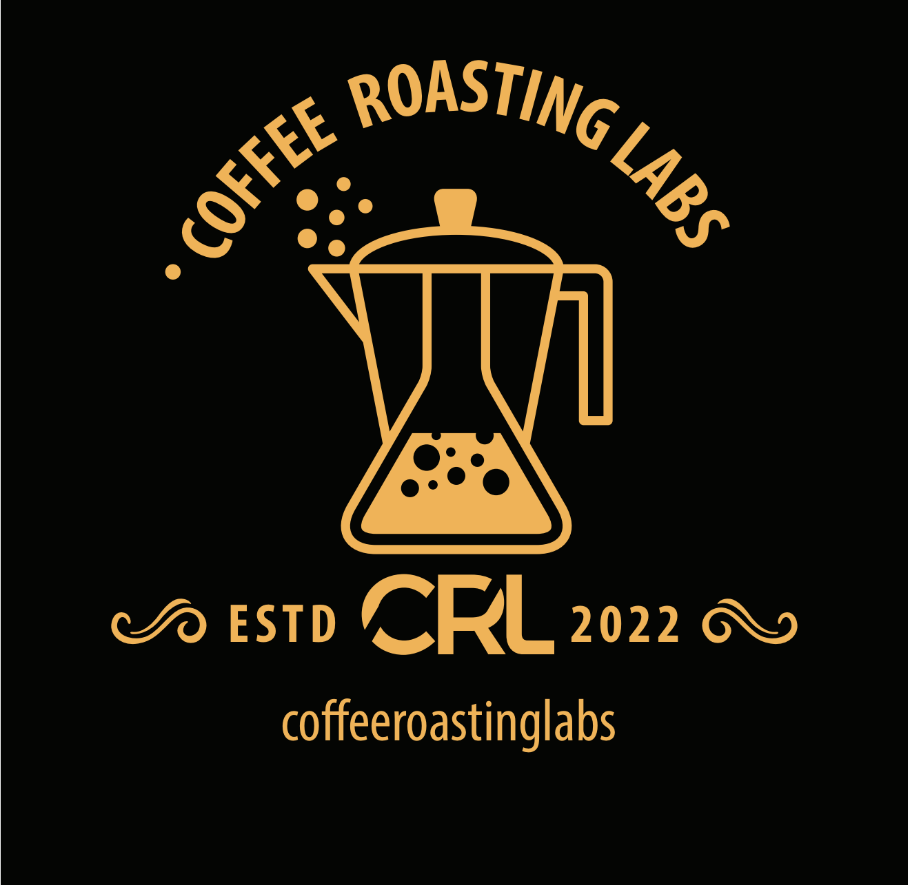

**TOSTADURÍA ERIK BERWART ARAYA EIRL**  
Nombre de fantasía: **Coffee Roasting Labs**  
RUT: **77.586.349-8** · Fono / WhatsApp: **+56 9 2372 1634**

# CARTA PROPUESTA COMERCIAL

**Arriendo de equipo espresso profesional + asesoría + gestión de insumos de barra**

---

Santiago, 26 de agosto de 2026

**Estimados(as):**

Por medio de la presente, **Tostaduría Erik Berwart Araya EIRL** (nombre de fantasía **Coffee Roasting Labs**) tiene el agrado de presentar su **propuesta comercial** para el arriendo de una barra espresso profesional Nuova Simonelli, acompañada de asesoría técnica-operativa y de la **gestión de insumos de barra** que el Cliente deberá adquirir para operar correctamente el equipo (entre ellos, tamper y Cafiza).

La presente oferta se estructura en cuatro secciones: (1) paquete de equipos, (2) referencias de mercado en Chile, (3) condiciones comerciales de esta propuesta, y (4) comparativo y alcance del servicio.

---

## 1. Paquete de equipos

Se pone a disposición del Cliente, en modalidad de **arriendo**, el siguiente set profesional:

| Ítem | Descripción | Valor referencial de mercado (compra) |
|------|-------------|----------------------------------------|
| Máquina espresso | **Nuova Simonelli Appia Life — 1 grupo** (semiautomática / volumétrica según stock) | ≈ $3.856.000 IVA incl. |
| Molino | **Nuova Simonelli MDX / MDXS** (dosificador u on demand, según acuerdo) | ≈ $1.080.000 – $1.535.100 IVA incl. |
| **Valor total del activo** | | **≈ $4.940.000 – $5.390.000 IVA incl.** |

**Uso recomendado:** cafetería de formato compacto, restaurant, hotel boutique u oficina con barra barista (referencia de operación: 80 a 150 tazas/día).

**Requisitos técnicos a cargo del Cliente:**
- Energía eléctrica 220–240 V
- Conexión a red de agua y desagüe (o alternativa técnica previamente validada)
- Espacio de barra aproximado de 80–100 cm lineales
- Condiciones de higiene y uso acorde a equipos de grado profesional

Los valores de compra indicados corresponden a referencias públicas de distribuidores en Chile (Cafestore, Café Altura y equivalentes) y se incluyen solo a modo de contexto del activo arrendado; **no constituyen precio de venta**.

---

## 2. Referencias de mercado en Chile

Para contextualizar esta oferta, se consideran rangos publicados por empresas que operan arriendo y/o comodato de café en el país:

| Empresa / fuente | Modalidad | Rango referencial |
|------------------|-----------|-------------------|
| La Finca | Comodato espresso / grano automático | Desde ≈ $399.990 / mes (consumo mínimo de insumos) |
| Nolichile | Arriendo profesional alta capacidad | ≈ $280.000 – $600.000 / mes (equipo; café aparte) |
| Nolichile | Comodato oficina | Mínimos típicos 4–8 kg o 12–25 kg café / mes, según tamaño |
| MiTTantó | Arriendo vending de grano | Desde ≈ $250.000 / mes (segmento automático / vending) |
| Corporate Coffee | Comodato / arriendo / compra | Máquina en comodato a cambio de consumo mínimo |

**Café en grano (referencia mayorista / plan):** selección ≈ $14.000–$28.000 / kg; especialidad ≈ $28.000–$45.000 / kg.

Respecto de esos rangos, la presente propuesta ofrece un **arriendo de equipo significativamente más competitivo**, complementado con **asesoría** y con la **gestión de insumos de barra** que el Cliente debe comprar para operar el set.

---

## 3. Condiciones comerciales de esta propuesta

### 3.1 Modalidad y plazo

| Condición | Detalle |
|-----------|---------|
| Arrendador | **Tostaduría Erik Berwart Araya EIRL** — Coffee Roasting Labs · RUT **77.586.349-8** |
| Modalidad | **Arriendo** de Appia Life 1 grupo + molino MDX/MDXS |
| Cuota mensual | **$150.000** (ciento cincuenta mil pesos chilenos) **+ IVA** |
| Inicio de cobro | **A contar del 1 de enero de 2027** (año próximo) |
| Duración del contrato | **12 meses** (un año), contados desde la fecha de inicio de cobro |
| Renovación | De común acuerdo, por escrito, antes del vencimiento |
| Contacto | **+56 9 2372 1634** |

### 3.2 Asesoría incluida

Durante la vigencia del contrato, Coffee Roasting Labs entregará **asesoría** orientada a la correcta operación de la barra, que podrá incluir, según necesidad del Cliente:

- Puesta en marcha e instalación inicial (sujeta a cobertura geográfica acordada)
- Capacitación básica de uso de máquina y molino
- Recomendaciones de receta, molienda, extracción y limpieza diaria
- Orientación en mantención preventiva rutinaria de barra
- Soporte remoto / coordinación de visitas técnicas según disponibilidad

La asesoría no reemplaza el servicio técnico correctivo mayor ni el reemplazo de piezas por mal uso, los que se cotizarán por separado cuando corresponda.

### 3.3 Insumos de barra — a cargo del Cliente, con gestión de Coffee Roasting Labs

Para operar y mantener el equipo en condiciones adecuadas, el Cliente deberá **adquirir por su cuenta** (es decir, **comprarlos ellos**) al menos los siguientes insumos de barra:

| Insumo | Descripción / uso |
|--------|-------------------|
| **Tamper** | Herramienta de prensado profesional compatible con el portafiltro del equipo |
| **Cafiza** (o equivalente Urnex Cafiza) | Detergente profesional para backflush y limpieza de grupo |
| Otros insumos de barra | Según necesidad operativa (ej.: detergente de leche, cepillos, jarras, filtros, etc.) |

**Gestión por parte de Coffee Roasting Labs:**
- Aunque la **compra y el pago** de estos insumos son de cargo del Cliente, Coffee Roasting Labs **puede gestionar** su cotización, pedido, reposición y/o entrega, facilitando el abastecimiento.
- La gestión no implica que el Proponente asuma el costo de los insumos, salvo acuerdo escrito en contrario.
- El Cliente mantendrá stock mínimo razonable de Cafiza y elementos de higiene de barra para el uso correcto del equipo arrendado.
- Cualquier costo de insumos gestionados se traspasará al Cliente (precio de proveedor + eventuales gastos de gestión/flete previamente informados).
- La cuota de arriendo de **$150.000 + IVA** **no incluye** el valor de tamper, Cafiza ni demás insumos.

### 3.4 Qué incluye / qué no incluye la cuota de $150.000

**Incluye:**
- Uso del set Appia Life 1 grupo + MDX/MDXS durante el plazo contractual
- Asesoría según numeral 3.2
- Coordinación de instalación inicial (dentro del perímetro acordado)
- Gestión/orientación para la compra de insumos de barra (tamper, Cafiza y afines), sin asumir su costo

**No incluye (salvo acuerdo escrito en contrario):**
- Valor de tamper, Cafiza u otros insumos de barra (de cargo del Cliente)
- Café en grano u otros productos de consumo alimentario (salvo que se contraten aparte)
- Ablandador de agua, filtros de agua, instalación hidráulica especial o obras en local
- Repuestos por mal uso, golpes, cal o falta de limpieza
- Visitas técnicas correctivas fuera de lo cubierto por la asesoría básica
- Flete e instalación fuera de la zona de cobertura definida

### 3.5 Salida anticipada

Si el Cliente solicita el término del contrato **antes del cumplimiento de los 12 meses**, deberá pagar una **penalización equivalente a 3 (tres) cuotas mensuales de arriendo**, esto es:

> **3 × $150.000 = $450.000 + IVA**

Dicha penalización es independiente de:
- La devolución del equipo en buen estado (desgaste normal aceptado)
- El pago de cuotas adeudadas hasta la fecha efectiva de retiro
- Eventuales cargos por daño, pérdida o incompleto del set arrendado

El retiro del equipo se coordinará dentro de un plazo razonable una vez pagadas las obligaciones pendientes.

### 3.6 Otras condiciones

- Facturación mensual de la cuota de arriendo, a nombre de **Tostaduría Erik Berwart Araya EIRL**, RUT **77.586.349-8**, según calendario que se indique en el contrato.
- El equipo permanece de propiedad del Arrendador durante toda la vigencia.
- El Cliente no podrá subarrendar, ceder ni trasladar el equipo sin autorización escrita.
- Al término (ordinario o anticipado regularizado), el Cliente restituirá máquina, molino y accesorios entregados en inventario de recepción.

---

## 4. Comparativo y alcance del servicio

### 4.1 Posicionamiento frente al mercado

| Concepto | Mercado referencial (Chile) | Esta propuesta — Coffee Roasting Labs |
|----------|-----------------------------|----------------------------------------|
| Arriendo / pack espresso profesional | ≈ $280.000 – $600.000 / mes, o comodatos desde ≈ $400.000 / mes en insumos | **$150.000 / mes** desde ene-2027 |
| Plazo típico | 12 a 36 meses | **12 meses** |
| Salida anticipada | Suele ser % de cuotas restantes o cláusulas equivalentes | **Penalización fija: 3 cuotas ($450.000 + IVA)** |
| Diferencial | Solo equipo o solo consumo de café | **Equipo + asesoría + gestión de insumos de barra (tamper, Cafiza, etc.), de cargo del Cliente** |

### 4.2 Resumen económico para el Cliente (año contractual)

| Concepto | Monto |
|----------|-------|
| Arriendo anual (12 × $150.000) | **$1.800.000 + IVA** |
| Insumos de barra (tamper, Cafiza y otros) | **De cargo del Cliente** (pueden gestionarse a través de Coffee Roasting Labs) |
| Penalización por salida anticipada | **$450.000 + IVA** (solo si aplica) |

### 4.3 Beneficio esperado

Con esta estructura, el Cliente obtiene:
1. Acceso a un set barista profesional (Appia Life + MDX) **sin invertir ~$5.000.000** en compra.
2. Una cuota de arriendo **bajo el rango habitual** de arriendos profesionales publicados en Chile.
3. **Asesoría** de Coffee Roasting Labs para operar y cuidar el equipo.
4. Claridad en insumos críticos de barra (**tamper, Cafiza y afines**): los compra el Cliente, y Coffee Roasting Labs puede **gestionar** su abastecimiento.
5. Contrato acotado a **un año**, con regla simple y previsible de salida anticipada.

---

## Vigencia de la oferta

La presente carta-propuesta tiene una vigencia de **30 días corridos** desde su fecha de emisión, salvo prórroga escrita. Los valores están expresados en pesos chilenos y se entienden **más IVA**, salvo que se indique expresamente lo contrario.

La aceptación de esta propuesta se formalizará mediante contrato de arriendo y anexos de inventario e insumos, los que prevalecerán en caso de diferencia de interpretación.

---

Sin otro particular, quedamos atentos a sus comentarios para ajustar cobertura geográfica, fecha exacta de instalación y la gestión del pedido inicial de insumos (tamper, Cafiza y complementos).

Atentamente,

_______________________________  
**Tostaduría Erik Berwart Araya EIRL**  
Nombre de fantasía: **Coffee Roasting Labs**  
RUT: **77.586.349-8**  
Fono / WhatsApp: **+56 9 2372 1634**  

---

### Anexos sugeridos al firmar (no incluidos en esta carta)

- Anexo A: Inventario de entrega (máquina, molino, portafiltros, accesorios)
- Anexo B: Listado referencial de insumos de barra a cargo del Cliente (tamper, Cafiza, etc.) y modalidad de gestión
- Anexo C: Acta de instalación y capacitación
